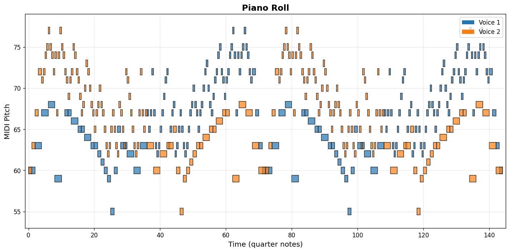
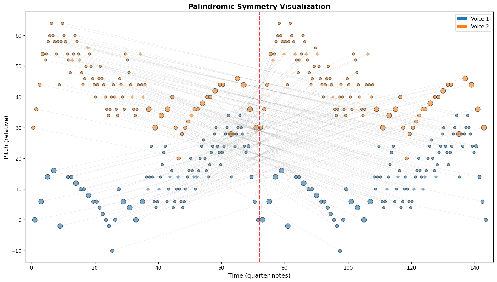
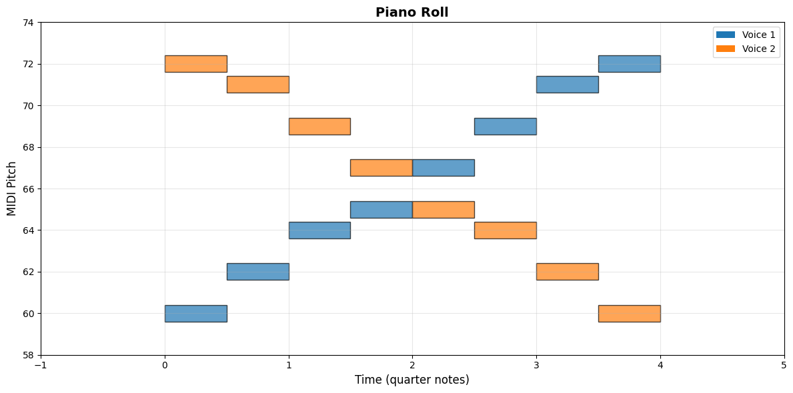
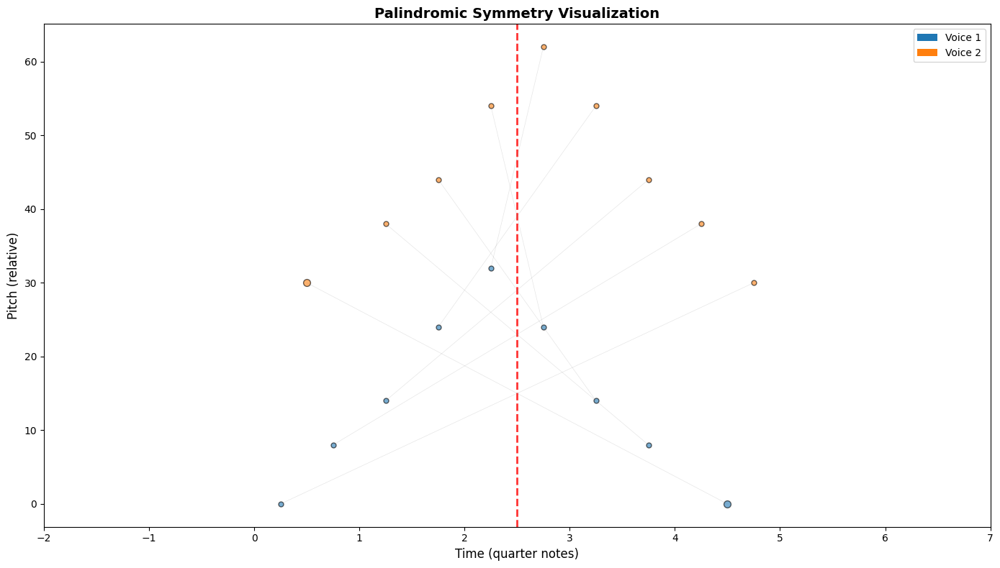
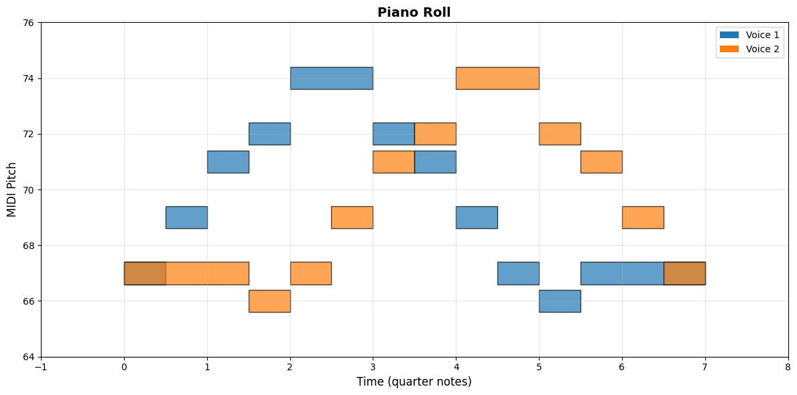
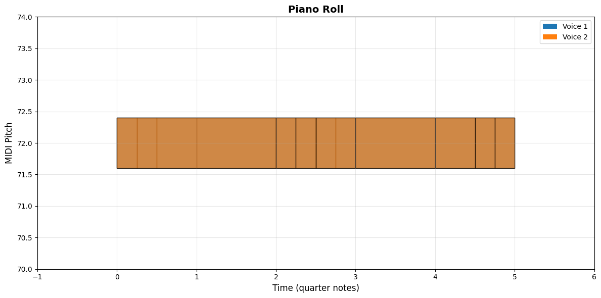
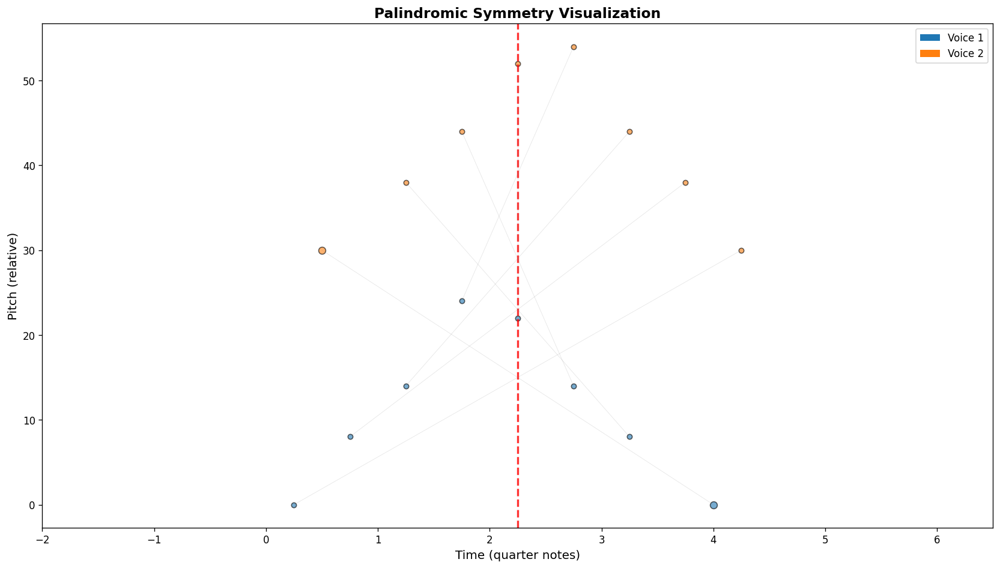

# 🎨 Cancrizans Gallery

Visual and audio examples of crab canons, palindromic structures, and musical transformations.

## 📊 Table of Contents

- [Bach's Crab Canon (BWV 1079)](#bachs-crab-canon)
- [Educational Examples](#educational-examples)
- [Visualizations](#visualizations)
- [Custom Canons](#custom-canons)

---

## 🎼 Bach's Crab Canon

The authentic **Canon Cancrizans** from *The Musical Offering* (BWV 1079).

### Statistics
- **Composer:** Johann Sebastian Bach (1685-1750)
- **Parts:** 2 voices
- **Duration:** 144 quarter notes (~2.4 minutes at 60 BPM)
- **Notes:** 184 per voice
- **Palindrome:** ✓ Verified

### Files
- [`examples/bach_crab_canon.mid`](examples/bach_crab_canon.mid) - MIDI playback
- [`examples/bach_crab_canon.musicxml`](examples/bach_crab_canon.musicxml) - Musical notation
- [`data/bach_crab_canon_original.mid`](data/bach_crab_canon_original.mid) - Original source

### Visualizations

#### Piano Roll


*Shows all notes plotted on a pitch-time grid. Note how the two voices create mirror patterns.*

#### Symmetry Plot


*The red vertical line marks the temporal midpoint. Gray connectors link palindromic note pairs.*

---

## 📚 Educational Examples

Simple crab canons demonstrating different musical concepts.

### 1. Scale Crab Canon

A C major scale (C-D-E-F-G-A-B-C) played forward and backward simultaneously.

- **File:** [`examples/01_scale_crab_canon.mid`](examples/01_scale_crab_canon.mid)
- **Concept:** Basic retrograde transformation
- **Duration:** 4 quarter notes



### 2. Arpeggio Crab Canon

A C major arpeggio (C-E-G-C-E) creating harmonic palindrome.

- **File:** [`examples/02_arpeggio_crab_canon.mid`](examples/02_arpeggio_crab_canon.mid)
- **Concept:** Harmonic structures in palindrome
- **Duration:** 5 quarter notes



### 3. Melodic Phrase Crab Canon

A lyrical melody demonstrating phrase-level palindrome.

- **Files:**
  - [`examples/03_melody_crab_canon.mid`](examples/03_melody_crab_canon.mid)
  - [`examples/03_melody_crab_canon.musicxml`](examples/03_melody_crab_canon.musicxml)
- **Concept:** Melodic contour in retrograde
- **Duration:** 7 quarter notes




### 4. Rhythmic Crab Canon

Same pitch (C5) with varied rhythms creating temporal palindrome.

- **File:** [`examples/04_rhythm_crab_canon.mid`](examples/04_rhythm_crab_canon.mid)
- **Concept:** Rhythmic retrograde (pitch-agnostic)
- **Duration:** 5 quarter notes



### 5. Chromatic Crab Canon

All 12 semitones of the chromatic scale in palindrome.

- **File:** [`examples/05_chromatic_crab_canon.mid`](examples/05_chromatic_crab_canon.mid)
- **Concept:** Chromatic motion in retrograde
- **Duration:** ~5 quarter notes


---

## 🎨 Custom Canons

User-created examples from the Jupyter notebook.

### My Crab Canon

A simple custom melody demonstrating the `assemble_crab_from_theme()` function.

- **File:** [`examples/my_crab_canon.mid`](examples/my_crab_canon.mid)
- **Created with:** Jupyter notebook
- **Source:** C major arpeggio (C-E-G-C-B-G-E-C)




---

## 🔍 Understanding the Visualizations

### Piano Roll
- **X-axis:** Time (in quarter notes)
- **Y-axis:** MIDI pitch number
- **Colors:** Different voices
- **Rectangles:** Note duration and pitch

### Symmetry Plot
- **Red dashed line:** Temporal midpoint
- **Blue/Green circles:** Notes from each voice
- **Gray connectors:** Palindromic pairs (note i ↔ note N-1-i)
- **Vertical position:** Relative pitch
- **Horizontal position:** Time

---

## 💡 Try It Yourself

### Command Line

```bash
# Analyze any MIDI file
python -m cancrizans analyze examples/bach_crab_canon.mid

# Create visualizations
python -m cancrizans render \
  --input examples/01_scale_crab_canon.mid \
  --roll my_roll.png \
  --mirror my_mirror.png
```

### Python API

```python
from music21 import stream, note
from cancrizans import assemble_crab_from_theme, is_time_palindrome
from cancrizans.io import to_midi
from cancrizans.viz import piano_roll, symmetry

# Create a theme
theme = stream.Stream()
theme.append(note.Note('D4', quarterLength=1.0))
theme.append(note.Note('F#4', quarterLength=1.0))
theme.append(note.Note('A4', quarterLength=2.0))

# Make it a crab canon
canon = assemble_crab_from_theme(theme)

# Verify and export
print(is_time_palindrome(canon))  # True
to_midi(canon, 'my_canon.mid')
piano_roll(canon, 'my_roll.png')
symmetry(canon, 'my_mirror.png')
```

### Jupyter Notebook

See [`notebooks/bach_crab_canon_exploration.ipynb`](notebooks/bach_crab_canon_exploration.ipynb) for an interactive tutorial.

---

## 📖 Further Reading

- **[README.md](README.md)** - Project overview
- **[EXAMPLES.md](EXAMPLES.md)** - Auto-generated usage examples
- **[Bach's Musical Offering](https://en.wikipedia.org/wiki/The_Musical_Offering)** - Historical context
- **[Hofstadter: GEB](https://en.wikipedia.org/wiki/G%C3%B6del,_Escher,_Bach)** - Philosophical exploration

---

*All musical examples are generated programmatically and verified to be true palindromes using `is_time_palindrome()`.*

**License:** Code (MIT) | Bach Score (Public Domain) | Generated Examples (CC0)
